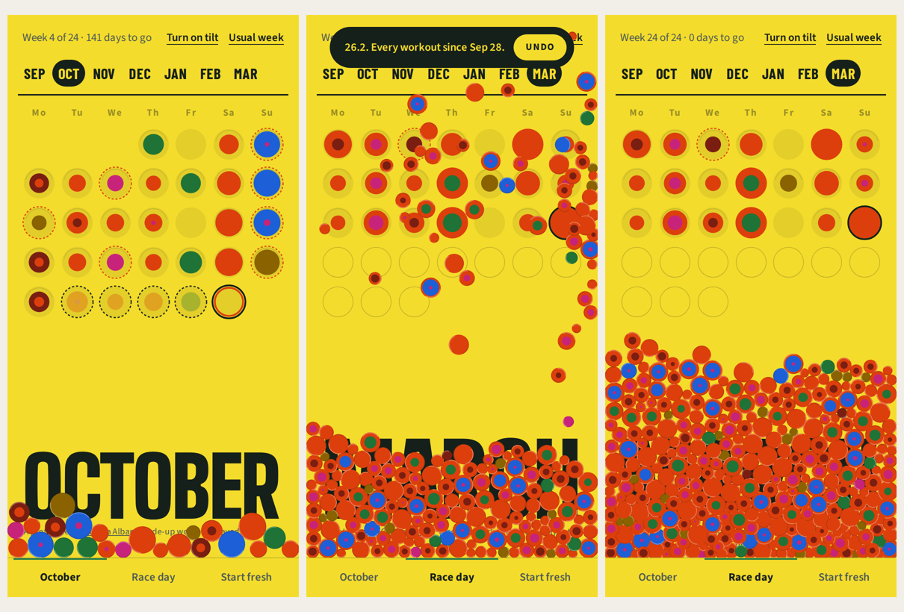

# Punch Card

A marathon training calendar you punch like a card.

**Try it:** https://niftyclaudia.github.io/punch-card/ (best on a phone)

## What it does

- **One page per month**, from the first week of training to race day. Each month has its own paper color and its name set large at the bottom.
- **Every day is a circle.** A planned workout is an outline in the activity's color. When a workout comes in from the watch, the day waits with a dashed ring.
- **Press and hold to punch.** The circle squeezes like a real hole punch, the piece pops out, and it falls to the bottom of the screen.
- **The pile is yours to play with.** Pieces roll wherever you tip your phone (tap **Turn on tilt** first), can be pushed with a finger, and follow the arrow keys on a laptop.
- **Race day.** Punching the 21st bursts every workout of the season out of that one circle.

Dot size is the total time that day; the rings show how the time was split across running, cycling, strength, Pilates/yoga, climbing and everything else.

## The demo

The page opens on a made-up October with most days punched and a few waiting. The buttons at the bottom switch to:

- **Race day**: the whole season punched, with the 21st waiting for you.
- **Start fresh**: a clean month to log and punch your own days.

Nothing leaves your browser. Punches are saved in this browser only, and nothing is sent anywhere.

## How it was made

The idea started from two print pieces: a riso-printed wall calendar with a huge condensed month name, and a dot-grid poster where colored dots pile up over time. The goal was a training log that feels like marking a paper card, not filling in a spreadsheet.

The design went through a direction and color board first, then screen by screen: which days get numbers (none, it's a pattern, not a calendar), how many paper colors, how a punched hole should look (a hairline, not a shadow), and how much motion the punch needs.

It was built as a tab in a personal marathon training app that pulls workouts from a Garmin watch. This repo is the punch card on its own, with sample data.

## Built with

- Plain HTML, CSS and JavaScript in one file (`index.html`), no build step
- [Matter.js](https://brm.io/matter-js/) for the falling, rolling pieces
- Big Shoulders Display, Barlow Condensed and Source Sans 3 from Google Fonts

To run it locally, open `index.html` in a browser, or serve the folder (`python3 -m http.server`) to try tilt on a phone over your network.
